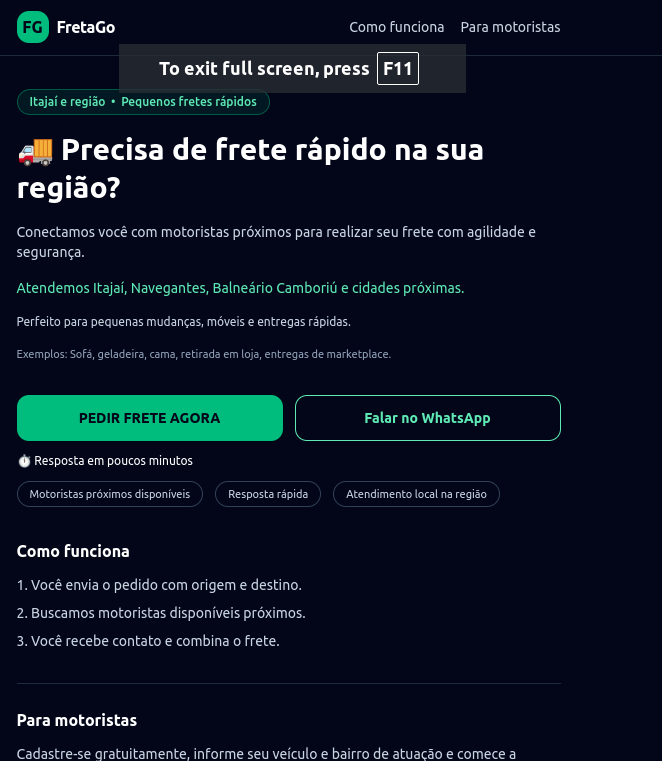

🚚 FretaGo

FretaGo is a regional MVP marketplace that connects customers with nearby drivers for small and fast freight deliveries — focusing on real-world logistics needs like furniture transport, store pickups, and marketplace deliveries.

## 📸 Preview

## 📍 Coverage Area

FretaGo currently operates in:

Itajaí
Navegantes
Balneário Camboriú
Camboriú
Nearby cities

The platform is designed to expand regionally over time.

## ⚡ Current MVP Focus

The current version is focused on validation and real usage, not full automation.

Main flow:
User submits a freight request (no login required)
Request is stored and processed
Customer is redirected to WhatsApp for fast negotiation
Driver is matched manually
Freight is completed

👉 The goal is speed, simplicity, and real-world execution

## 💡 Why this project?

FretaGo was created to solve a real-world problem:

People often need fast delivery for small items but struggle to find reliable drivers quickly.

Instead of over-engineering, this project focuses on:

Real usage
Fast validation
Simple and effective solutions
Direct communication via WhatsApp
🧩 Features
✅ Current MVP
Freight request creation (origin, destination, item)
No-login flow for fast conversion
Regional positioning (local drivers)
Success page with WhatsApp integration
Pre-filled WhatsApp message for faster contact
Simple request management (Rails backend)
Responsive UI with TailwindCSS

## 🚀 Future Improvements

Planned based on real-world usage:

Driver matching optimization
Request status tracking
Pricing support and suggestions
Admin dashboard improvements
Driver onboarding flow
Regional expansion

## 📚 Key Learnings

Building MVPs focused on real-world validation
Designing backend systems with Ruby on Rails
Creating conversion-oriented user flows
Integrating WhatsApp as a business tool
Balancing product development with business execution

## 🛠 Tech Stack

Ruby 3.x
Ruby on Rails 7.x
PostgreSQL
TailwindCSS
Hotwire / Stimulus
▶️ Running Locally

# Install dependencies

bundle install

# Setup database

bin/rails db:prepare
bin/rails db:seed

# Run the app

bin/dev

Then open:

👉 http://localhost:3000

🔐 Environment Variables
FRETAGO_WHATSAPP_NUMBER=5547999999999
📌 Project Status
MVP under validation
Focused on real-world usage
Continuously evolving based on feedback
⚠️ Disclaimer

This project is intended for portfolio and learning purposes.

It is not yet a production-ready logistics platform.

## 📄 License

## MIT License

## 👨‍💻 Author

Fábio Lucas de Melo

GitHub: https://github.com/FabioMelo10
LinkedIn: https://www.linkedin.com/in/fabio-lucas-de-melo/

## 💥 Final Note

FretaGo is not just a project — it's a real attempt to build a business from scratch.

Start simple. Validate fast. Grow with real users.
